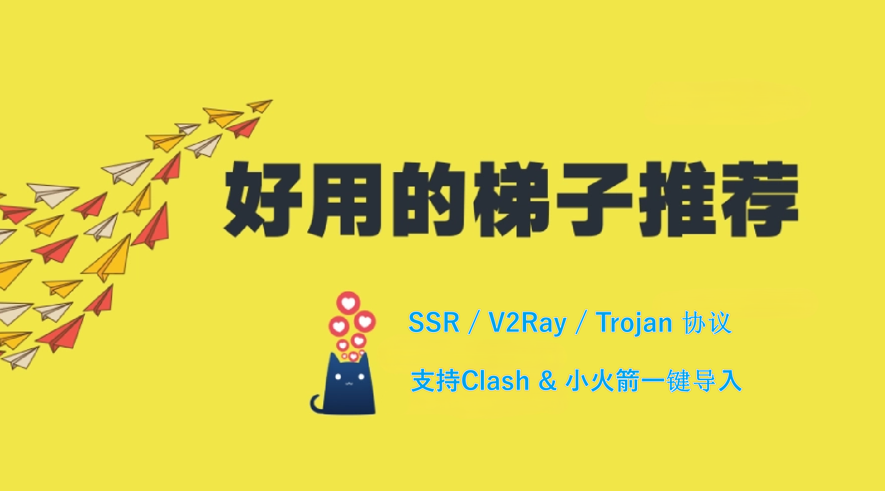
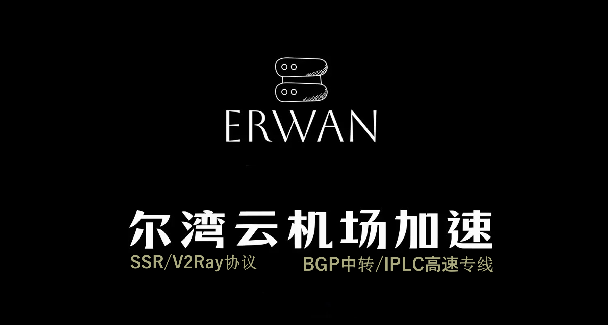
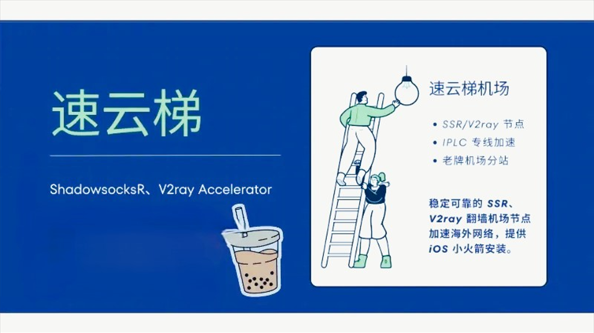

# 2026魔法外网梯子推荐︱翻墙机场节点︱稳定好用便宜靠谱的科学上网VPN加速器

**2026年，使用Clash或小火箭节点等魔法外网梯子已成为基本技能。无论是外贸人员访问谷歌、程序员查阅GitHub，还是影迷解锁观看Netflix等流媒体的4K内容，传统免费VPN梯子已无法满足需求。翻墙机场以稳定、高速和大流量的优势，成为梯子推荐中的首选。**

这里分享几个稳定、快速、安全、便宜的**机场推荐**，安卓苹果手机系统和PC电脑Windows系统都能用的翻墙软件梯子工具，提供 Shadowsocks、ShadowsocksR、VMess、VLESS（Reality）、Trojan、Hysteria 多种协议，支持 Clash、Clash Verge、ClashX、Shadowrocket（小火箭）、Stash（Clash for iOS）、Quantumult X（圈叉）、Surge、V2rayN、sing-box 等多种流行的翻墙客户端，所有机场梯子都支持Clash节点一键导入Clash客户端使用。无论是Netflix奈飞、Disney迪士尼、HBO、Hulu、YouTube油管等**流媒体解锁机场**，还是日常工作学习，甚至上外网网络游戏加速的需求，都能完美解决，供大家参考。本文精选五款顶级机场——速云梯、优信云、疾风云、耐思云和尔湾云，助你找到最佳[VPN梯子 ](https://gitlab.com/cnvpn/Best_jichang)。

---

## 为什么选择翻墙机场？

免费梯子（如自由门、蓝灯）或自建VPS（如Vultr）速度慢、易被封，晚高峰几乎卡死。而**魔法梯子**依托SS/SSR、V2Ray、Trojan等协议，结合BGP中转和IPLC专线，提供更强的抗封锁能力和流畅体验。相比免费工具，收费的**翻墙机场**在安全性、稳定性和性价比上更胜一筹，尤其是海外运营的机场 ，跑路风险低，隐私有保障。

一分钱一分货：便宜直连易翻车，专线支持的**VPN梯子**才是正解。以下是2026年的顶级梯子推荐。

---

## 2026顶级翻墙机场推荐

|机场名称|热门指数|官网地址|最低价格|流量范围|特点|
| --- | --- | --- | --- | --- | --- |
|扬帆云|:star::star::star::star::star:|[扬帆云官网 ](https://affgo.cc/yafa)|15元/月|100GB-500GB|高速稳定，推荐首选|
|尔湾云|:star::star::star::star::star:|[尔湾云官网 ](https://affgo.cc/ewan)|13元/月|50GB-200GB|性价比首选，流量不清零|
|速云梯|:star::star::star::star::star:|[速云梯官网 ](https://affgo.cc/suyu)|19元/月|100GB-1200GB|8K视频解锁，游戏加速|
|疾风云|:star::star::star::star::star:|[疾风云官网 ](https://affgo.cc/jife)|14元/月|50GB-1200GB|大流量，流媒体优选|
|优信云|:star::star::star::star:☆|[优信云官网 ](https://affgo.cc/uxin)|15元/月|100GB-600GB|小众稳定，带宽充沛|

### 1. 扬帆云 - 2026魔法梯子推荐首选

**[扬帆云官网 ](https://affgo.cc/yafa)**

扬帆云由海外团队运营，主打Shadowsocks协议，提供多线入口和IEPL专线，100多条节点线路覆盖美国、新加坡、台湾、香港、日本及全球小众地区。

* **核心优势**: 解锁Netflix、Disney+、YouTube Premium，4K秒开；月付15元起，年付七折优惠；支持24H不满意退款；支持Clash、Shadowrocket等客户端。
* **套餐价格**:

|套餐|价格|每月流量|特点|
| --- | --- | --- | --- |
|初级套餐|15元/月|100GB|预算友好|
|中级套餐|30元/月|200GB|稳定日常使用|
|高级套餐|40元/月|400GB|深度科学上网用户|

* **评测体验**: 扬帆云节点丰富，晚高峰稳定，是**梯子推荐**中的首选。
* **优惠活动**: 年付享七折优惠。

---
### 2. 尔湾云 - 最稳定的便宜外网梯子

**[尔湾云官网 ](https://affgo.cc/ewan)**

尔湾云专注于SSR和V2Ray，采用GBP隧道中转和IEPL专线加速，海外团队运营，节点覆盖美国、法国、新加坡、日本、马来西亚、香港、台湾等地。

* **核心优势**: 月付13元起，流量月底不清零；解锁Netflix、ChatGPT、TikTok；一键导入Clash等插件。
* **套餐价格**:

|套餐|价格|每月流量|特点|
| --- | --- | --- | --- |
|基础版|12元/月|50GB|学生党首选|
|标准版|16元/月|100GB|日常使用|
|高级版|26元/月|200GB|高性价比|

* **评测体验**: 尔湾云低价稳定，适合学生，是**魔法梯子**的入门之选。
* **优惠活动**: 流量全到账，月底不清零。年付七折 优惠码 SS12

---

### 3. 速云梯 - 2026稳定高速的翻墙机场

**[速云梯官网 ](https://affgo.cc/suyu)**

速云梯主打SS/V2Ray协议，全球部署超3000台服务器，100+节点覆盖美国、日本、香港等地，配备BGP中转和IPLC专线。

* **核心优势**: 支持8K视频，是顶级的**流媒体解锁机场**，解锁Netflix、Hulu、Disney+；月付19元起，流量充足；AES-256加密，无日志运营。
* **套餐价格**:

|套餐|价格|每月流量|特点|
| --- | --- | --- | --- |
|入门版|19.99元/月|100GB|适合轻度用户|
|标准版|39.99元/月|350GB|中度使用优选|
|旗舰版|99.99元/月|1200GB|重度用户首选|

* **评测体验**: 速云梯稳定性一流，游戏加速和4K视频体验极佳，专线节点抗封锁突出。
* **优惠活动**: 年付享7折，优惠码 **YYY11**（截止2025年2月1日）。

---

### 4. 疾风云 - 最佳流媒体解锁机场

**[疾风云官网 ](https://affgo.cc/jife)**

疾风云支持SSR和V2Ray，配备BGP中转和IPLC专线，100多节点覆盖美国、法国、德国、日本、新加坡、泰国、马来西亚、香港、台湾等地。

* **核心优势**: 月付14元起，旗舰版1200GB；支持Netflix、Disney+、ChatGPT，8K无压力；优惠折扣活动多，支持24小时不满意退款。
* **套餐价格**:

|套餐|价格|每月流量|特点|
| --- | --- | --- | --- |
|入门版|14元/月|50GB|超低价入门|
|标准版|28元/月|200GB|均衡选择|
|旗舰版|98元/月|1200GB|大流量优选|

* **评测体验**: 疾风云兼顾低价和大流量，是**流媒体解锁机场**的性价比标杆。
* **优惠活动**: 年付享7折，优惠码 **jf2025**。

---

### 5. 优信云 - 稳定VPN梯子推荐

**[优信云官网 ](https://affgo.cc/uxin)**

优信云是新兴Shadowsocks/Trojan协议机场服务商，除了公网和直连节点还提供IPLC高速专线，支持24小时不满意退款。

* **核心优势**: 解锁国际流媒体平台和ChatGPT、TikTok、YouTube；月付15元起，性价比高；支持24小时退款。
* **套餐价格**:

|套餐|价格|每月流量|特点|
| --- | --- | --- | --- |
|基础版|15元/月|100GB|小众稳定|
|标准版|30元/月|200GB|日常优选|
|高级版|50元/月|600GB|高流量选择|

* **评测体验**: 优信云低调稳定，是**VPN梯子**中的潜力股，适合追求隐私的用户。
* **优惠活动**: 年付85折，优惠码 yx85

---

## 如何选择适合你的翻墙机场？

选择**翻墙机场**并非“一刀切”，需要根据个人需求权衡以下几个方面：

* **预算有限**: 尔湾云和扬帆云是**机场推荐**中的实惠选择，适合学生或偶尔使用外网的用户。它们的流量虽不算多，但对于日常浏览网页、查资料已足够。
* **稳定性优先**: 速云梯和扬帆云提供IPLC专线和BGP中转支持，节点覆盖广泛，即使在网络高峰期或敏感时期也能保持连接稳定。如果你需要长时间在线（如跨境电商、远程办公），这两款是不错的选择。
* **流媒体解锁**: 速云梯和疾风云是**流媒体解锁机场**的佼佼者，支持Netflix、Disney+甚至8K视频播放。它们的旗舰套餐流量充足（1200GB），延迟低，适合影迷或需要高清体验的用户。
* **特殊时期**: 在网络封锁加剧时，IPLC专线（如速云梯）表现出色，能有效绕过限制。
* **网络环境**: 如果你使用移动或教育网，选BGP中转线路更优，能适配不同运营商，减少延迟和丢包。电信用户可测试各机场节点，选择延迟最低的线路。

**额外建议**: 便宜梯子人多易堵，速云梯的高价（18元/月）换来的是顶级稳定性。建议根据使用频率选择月付或年付，同时准备备用机场。

---

## 如何使用翻墙机场？

使用**魔法梯子**比传统VPN稍复杂，但上手后非常简单。以下是详细步骤：

1. **注册购买**: 访问机场官网（[如扬帆云官网 ](https://affgo.cc/yafa)），注册账号并选择套餐。支付后，你会获得用户面板，包含订阅链接、流量统计和使用说明。
2. **下载客户端**: PC推荐 V2rayN 或 Clash，Android 用 Clash 或 Surfboard，iOS 用 Shadowrocket（需海外 Apple ID）。各家翻墙机场官网均提供下载及使用说明。
3. **导入订阅**: 登录面板，复制订阅链接，打开客户端，粘贴链接并更新，节点列表会自动加载。
4. **连接测试**: 选择低延迟节点（如“日本-50ms”），点击连接，验证谷歌或YouTube是否可用。

**常见问题**:

* **连接失败**: 检查订阅是否过期，或换节点测试。
* **速度慢**: 优先选IPLC节点（如速云梯）。
* **注意事项**: 订阅链接勿公开，发现异常及时重置。

**新手建议**: 新手不要上来就订年付套餐，按月订阅购买套餐先行试用。

---

## 机场选择小贴士

以下是实用建议，帮助你优化使用体验：

* **线路选择**: IPLC专线抗封锁强，BGP中转适配性好，公网直连最便宜。
* **速度评测**: 50Mbps以上且无断流即可满足4K需求，用客户端测速筛选最佳节点。
* **协议选择**: SS简单，V2Ray丰富，Trojan伪装强，Hysteria适合复杂网络。
* **备用方案**: 重度用户请备用机场，应对突发情况。
* **客服与社区**: 通常机场官网都提供翻墙插件及教程，如果你完全小白，那就选有客服的机场。

**小技巧**: 定期更新订阅，关注官网公告，避免节点失效。

---

## 结语

2026年，这些稳定的手机电脑科学上外网的梯子加速器凭借各自优势，成为**翻墙机场**中的顶尖选择。无论你是新手还是老手，这些**VPN梯子**都能满足需求。快选一款**魔法梯子**，畅享高速、无界网络吧！

---

免责声明： 本文所介绍的机场梯子VPN请只限用于正常外贸商务、新媒体、游戏娱乐、学习交流，切勿用在违法犯罪用途，用户请自觉遵守当地法律法规，出现一切后果本项目作者概不负责。

2026梯子推荐，翻墙机场 ，机场推荐 ，SS/SSR/机场，机场加速器购买，V2ray机场梯子，Trojan机场 ，Clash节点，好用的便宜梯子，翻墙梯子，VPN梯子 ，稳定梯子 ，手机电脑梯子，外网梯子，魔法梯子，油管梯子
